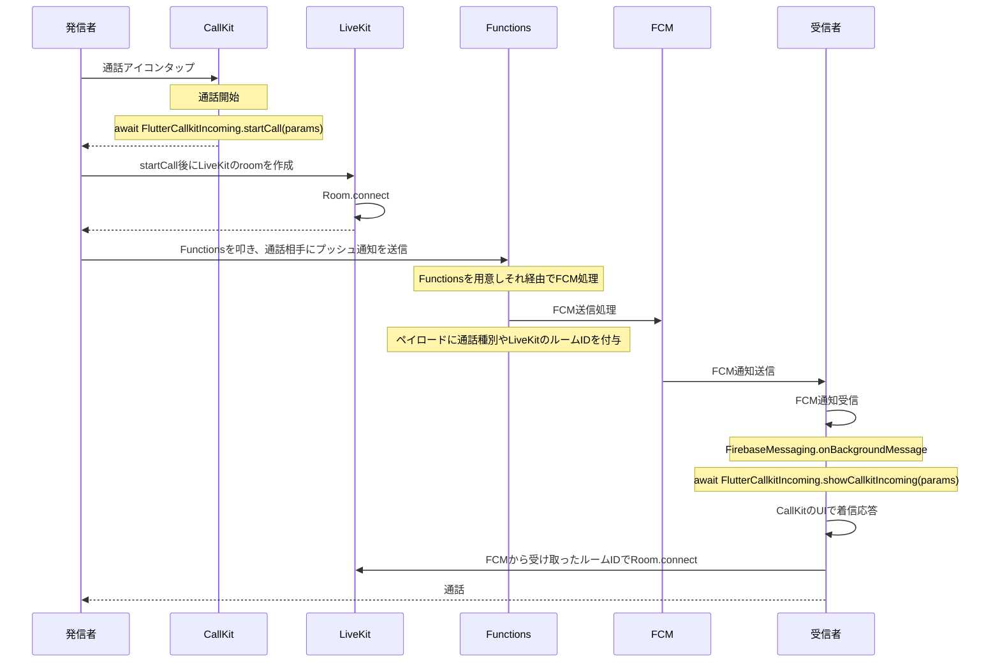

# FlutterLiveKitSample

## Architecture

- Flutter 3.16.5
- CallKit
- LiveKit(WebRTC)
  - <https://livekit.io/>
- Firebase Cloud Functions
- Firebase Cloud Messaging

## Sequence

```mermaid
sequenceDiagram
participant a as 発信者
participant b as CallKit
participant c as LiveKit
participant d as Functions
participant e as FCM
participant f as 受信者
    a ->> b: 通話アイコンタップ
    Note over b: 通話開始
    Note over b: await FlutterCallkitIncoming.startCall(params)
    b -->> a : 
    a ->> c : startCall後にLiveKitのroomを作成
    c ->> c : Room.connect
    c -->> a : 
    a ->> d : Functionsを叩き、通話相手にプッシュ通知を送信
    Note over d: Functionsを用意しそれ経由でFCM処理
    d ->> e : FCM送信処理
    Note over d: ペイロードに通話種別やLiveKitのルームIDを付与
    e ->> f : FCM通知送信
    f ->> f : FCM通知受信
    Note over f: FirebaseMessaging.onBackgroundMessage
    Note over f: await FlutterCallkitIncoming.showCallkitIncoming(params); 
    f ->> f : CallKitのUIで着信応答
    f ->> c : FCMから受け取ったルームIDでRoom.connect
    f -->> a : 通話
```
